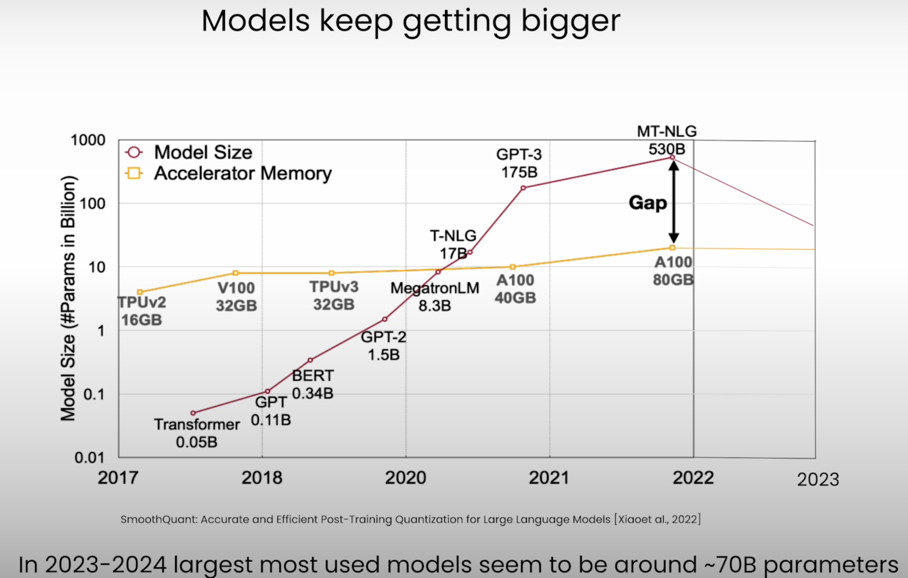
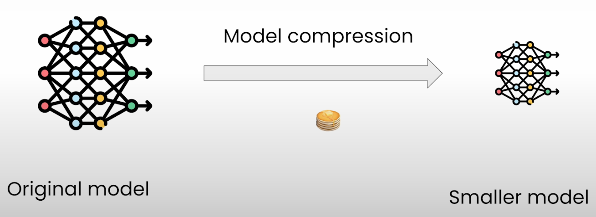
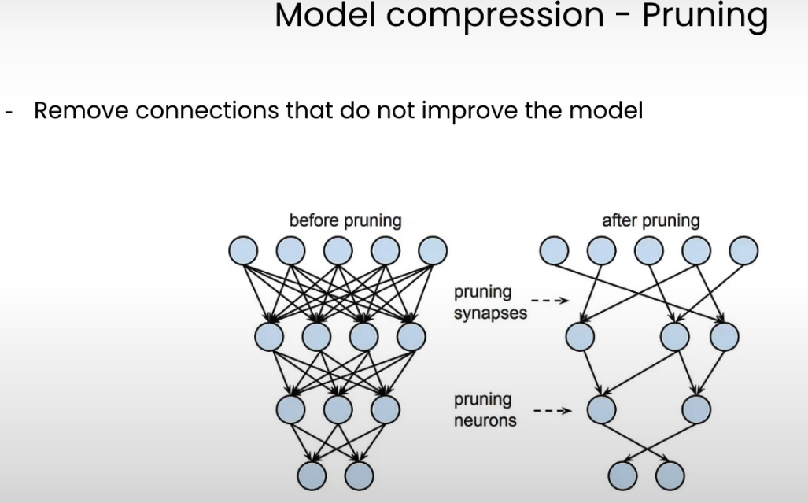
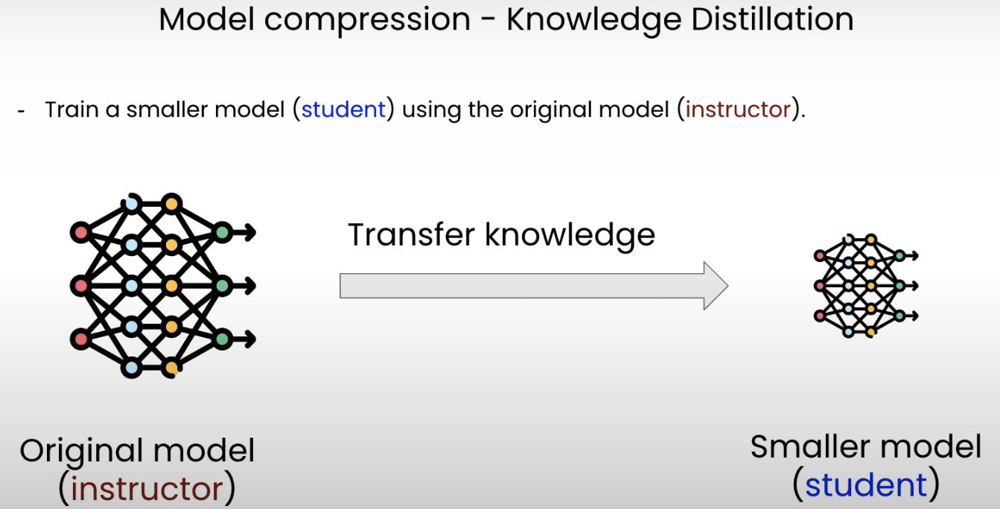
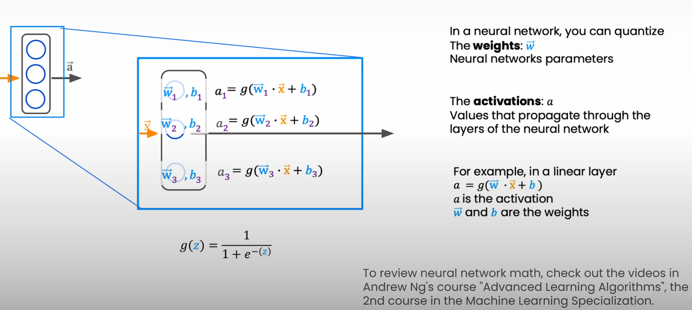
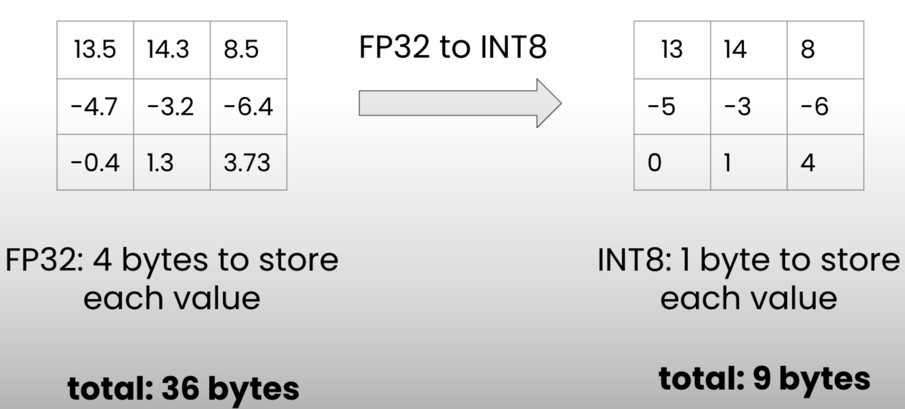
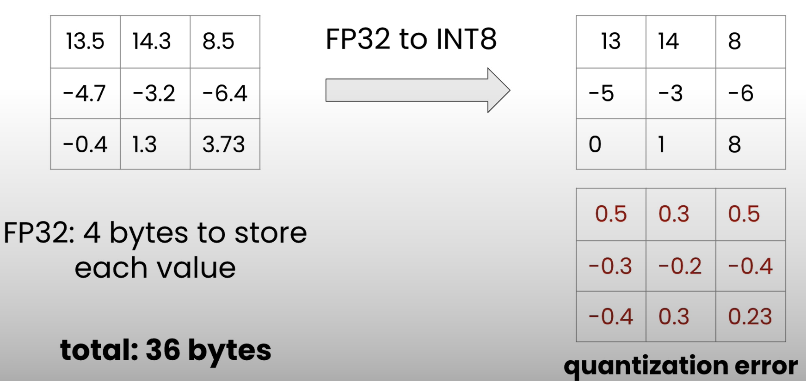
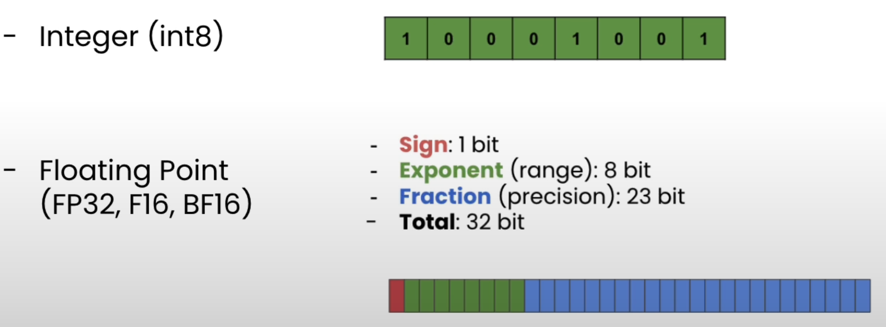
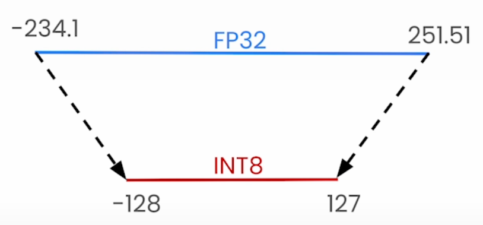

# Handling Big Models

- Memory requirement:
  - 
    - Highlights the gap between the memory requirements of LLM models and available hardwares.
  - 70 Billion parameter model would need approximately 280 GB just to make the model fit on the hardware.
  - [LLaMA 7B GPU memory requirement](https://discuss.huggingface.co/t/llama-7b-gpu-memory-requirement/34323/7)
    - Inference (full precision) requires 4 bytes/parameter * 7B = 28 Billion Bytes = ~28 GB
    - Training (Regular AdamW) requires 8 bytes per parameter * 7B = 56 Billion Bytes = ~56 GB
    - Also explains the computation for other precisions.
- Consumer type hardware such as NVIDIA T4 GPUs have only 16 GB RAM

- How to make these models accessible?
  - 
  - Before quantization, we'll discuss
    - Pruning
      
      - Consists of removing some layers based on metrics such as magnitudes of the weights.
    - Knowledge distillation
      
      - Challenge: Enough compute should be there to fit the original model and get predictions from it. It can be costly if original model is very large.
  
  
  - We can quantize either the weights `W` or the activations `A`.

## Model compression - Quantization

- **Idea**: Store the parameters of the model in lower precision.
- 
  - FP32: 4 bytes to store each value
  - INT8: 1 byte to store each value
- 
  - Whole challenge is to lower quantization error as much as possible to avoid any performance degradation.

## Topics covered in this course

- Data representation in ML Dtypes
  
- Quantization
  - Linear quantization explained
    
  - Apply linear quantization to real models using Quanto
  - Learn about quantization applications on Large Language Models where we'll go over the recent advances in quantization techniques applied to LLMs.
