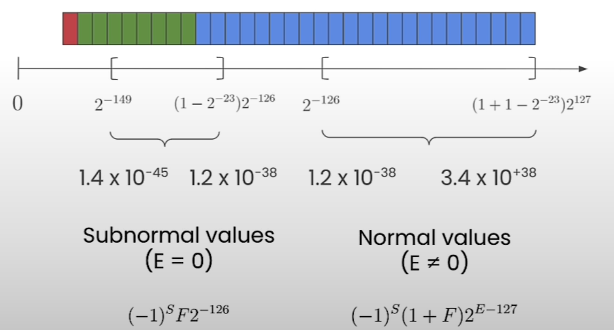
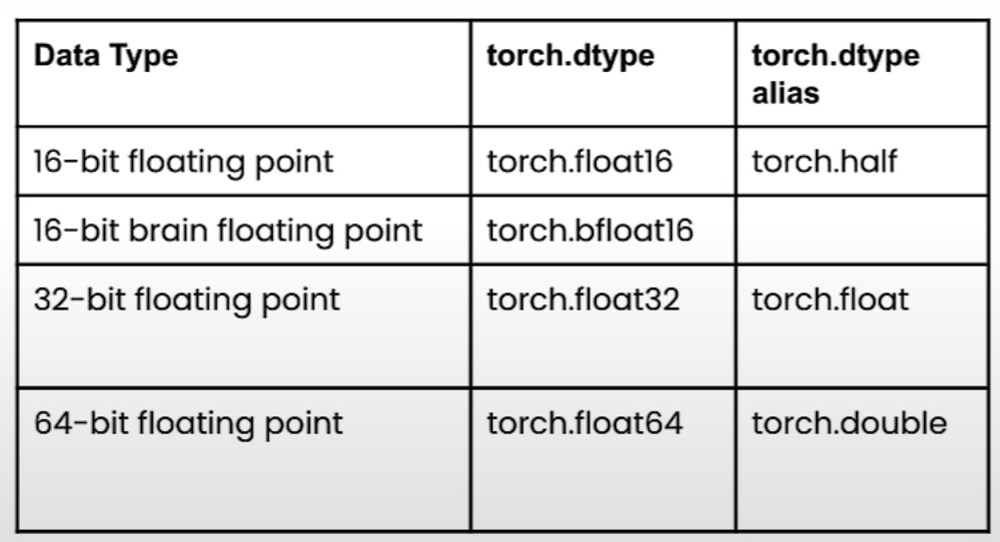

# Data Types and Sizes

## Integer

- 
- Signed integer can be represented in multiple representations. Here we have shown it as two's complement representation.
- Example: Addition of 2 + (-2)
  - 
  - Steps:
    - Step #1:
      
    - Step #2:
      - Carry forward 1 to next bit
      
    - Step #3:
      - Carry forward 1 to next bit
      
    - Step #4:
      - The carry forward bit is not stored as we have 4-bit representation. The carry forward 1 is dropped.
      

### Integer - PyTorch

- Ranges
  - Unsigned integer: [0, $2^n - 1$]
  - Signed integer two's complement representation: [$-2^{(n-1)}$, $2^{(n-1)} - 1$]

## Floating Point

### FP32

- Value range for positive value

  
  - Subnormal values: Small values
  - Normal values: Big values
  - Computation explained in [Wiki page](https://en.wikipedia.org/wiki/Single-precision_floating-point_format)
- Same range for negative value with negative sign

### FP16

### BF16

### Comparison

- FP16 and BF16 takes up half of the space of FP32

### Floating Point - PyTorch

- Python floats are FP64

### Floating Point - PyTorch Downcasting

- When a **higher** data type, such as a float is converted to a **lower** data type, such as an integer, it usually results in a **loss of data**.
- Advantages:
  - Reduced memory footprint
    - More efficient use of GPU memory
    - Enables the training of larger models
    - Enables larger batch sizes
  - Increased compute and speed
    - Computation using low precision (fp16, bf16) can be faster than fp32 since it requires less memory
      - But this depends on the hardware (e.g. Google TPU, NVIDIA A100)
- Disadvantages
  - Less precise

- Use case
  - Mixed precision training
    - Do computation in smaller precision (FP16/BF16/FP8)
    - Store and update the weights in higher precision (FP32)

## Notebook

- [Jupyter Notebook](../code/L2_data_types.ipynb)
