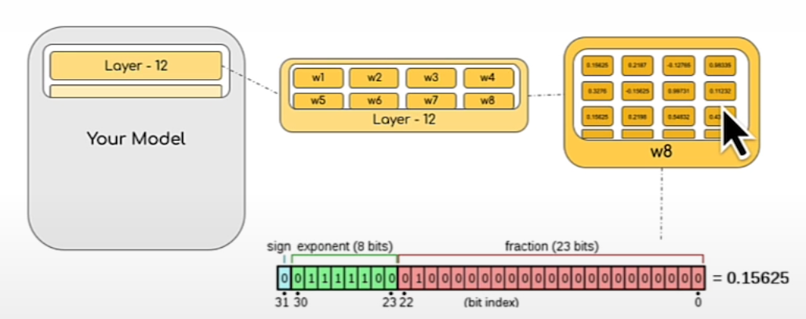

# Loading Models by Data Type

## Learning objectives

- Loading ML models in different data types (float32, float16, bfloat16)
- Load popular generative AI models in different precisions
- Study the impact of loading models in half-precision on their performance
- Load any model inside your workflow with your desired half-precision datatype out of the box

## What is a model parameter?

- Each layer of the model is composed of several weight, each of which has several parameters that are stored usually as a matrix of learnable parameters.

- In this example, each parameter is stored in 32-bit precision.
- ?? Usually in weight matrix, each row represent parameter vector. I don't understand why in the above diagram, a parameter is represented as matrix.

## Module casting in PyTorch

- Transformers by default load model in FP32 precision.
- An issue is that model needs to be loaded in FP32 first and then cast to other data types.
  - Solution: To directly load model into desired data type: `torch.set_default_dtype`

## Notebook

- [Jupyter notebook](../code/L3_models_with_different_data_types.ipynb)
- Compares the image caption generated by [BLIP: Bootstrapping Language-Image Pre-training for Unified Vision-Language Understanding and Generation](https://huggingface.co/Salesforce/blip-image-captioning-base) for data type `float32` vs `bfloat16`
- Observation:
  - The difference between the generated caption: `her dog` vs `a dog`
