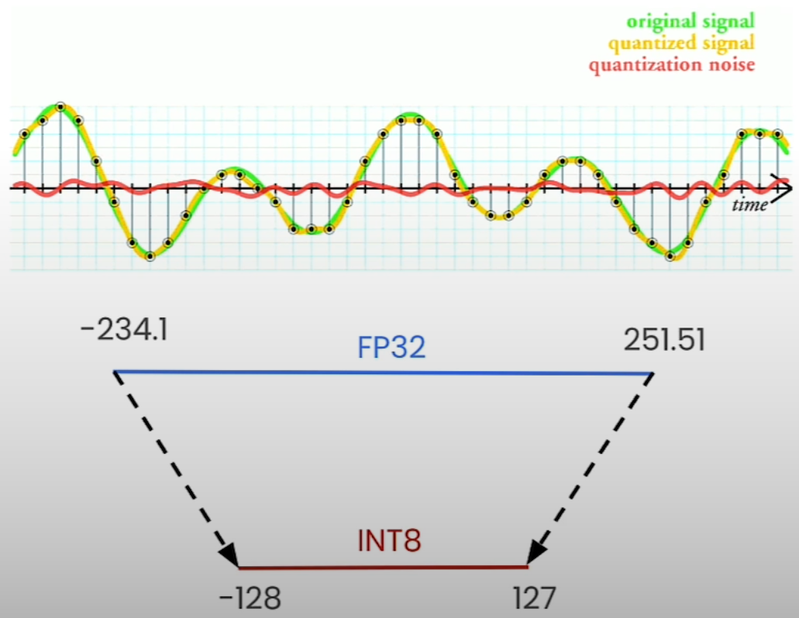

# Quantization Theory

## Learning Objectives

- Linear Quantization
- Apply linear quantization to real models using Quanto, a Python quantization toolkit from Hugging Face

## Quantization - Concept

- Quantization refers to the process of mapping a large set to a smaller set of values.

## Quantization - Example 8-bit linear quantization

- We map the extreme values together
  - Map biggest positive FP32 to 127 in INT8
  - Map smallest negative FP32 to -128 in INT8
- We fill the rest of the values following a linear mapping
- We delete the original tensor and store the scale (s) and zero point (z)

## Linear Quantization

- Even though being simple, it is used in many SOTA quantization methods
  - AWQ: Activation-aware Weight Quantization
  - GPTQ: GPT Quantized
  - BNB: BitsandBytes Quantization

## Estimate memory usage

- Pythia model in FP32
  - How many parameters?
    - $400 * 10^6$ parameters
    - 32 bits = 4 bytes
    - 8 bits -> 1 byte
  - How much memory?
    - $400 * 10^6$ params * 4 byte
    - = $1600 * 10^6$ bytes
    - = 1,600 megabytes
    - 1.6 gigabytes

- We can quantize weights as well as activations

## Memory Footprint

- Pythia model
  - Before quantization: 1.6 GB
  - After quantization: ~0.58 GB
    - (almost $\frac{1}{4}$)

## Mathematics Behind Linear Quantization

- Linear Quantization

- Scale and Zero Point

- Intermediate State

  - Useful for two things
    - Calibration
      - Calibrate model when quantizing the **activations** of the model
        - Range of activation values depends on what input was given
          - e.g. a different input text will generate different activations
        - Min/Max of activation ranges are used to perform linear quantization
        - How to get min and max range of activations?
          - Gather sample input data which are similar to the ones expected for running inference
          - Run inference
          - Calcualate min/max of activations
      - Result: Better quantized activations
    - Quantization Aware Training
      - Training in a way that controls how the model performs once it is quantized
        - Intermediate state holds both
          - a quantized version of weights
          - original unquantized weights
        - Forward pass (inference)
          - Use quantized verison of model weights to make predictions
        - Backpropagation (updating model weights)
          - Update original, unquantized verison of model weights

## Notebook

- [Monkey patching](https://www.educative.io/answers/what-is-monkey-patching-in-python)
- [Buffers](https://pytorch.org/docs/stable/notes/modules.html#module-state): Non-learnable aspects of computation
  - PyTorch documentation explains `buffers` using a running mean example.
- [Jupyter notebook](../code/L4_quantization_theory.ipynb)
