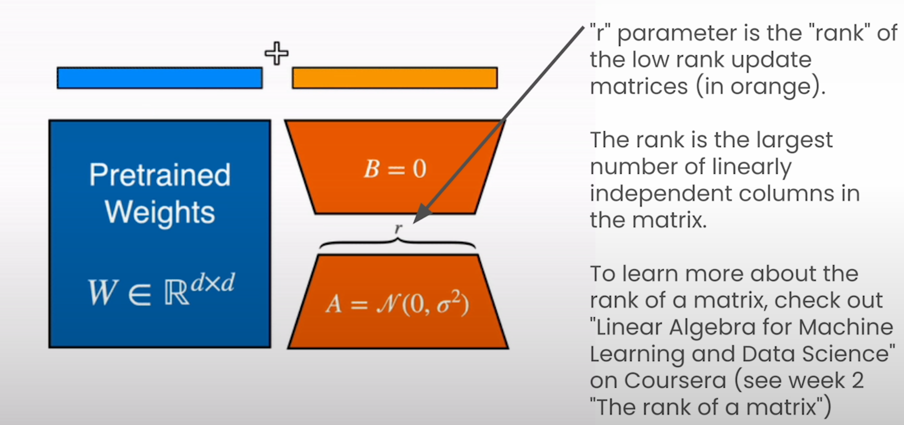

# Quantization of LLMs

## Overview of Quantization Methods for LLMs

- Recent SOTA quantization methods
  - LLM.INT8 (only 8-bit) - Aug 2022 - Dettmers et al.
    - Proposed a no-performance degradation 8-bit quantization method by decomposing the underlying matrix multiplication in two stages.
    - To mitigate emergent features from LLMs at scale, the authors proposed to decompose the MatMul in two stages, the outlier part in float16 and the non-outlier part in int8
  - QLoRA (only 4-bit) - May 2023 - Dettmers et al.
    - Make LLMs much more accessible by quantizing them in 4-bit precision and being able to fine-tune low-rank adapters on top of the model.
  - AWQ - June 2023 - Lin et al.
  - GPTQ - Oct 2022 - Frantar et al.
  - SmoothQuant - Nov 2022 - Xiao et al.
    - Pre-calibrate the model so that the quantized model does not get affected by large activations caused by large models.

- Even more recent SOTA quantization methods for 2-bit quantization
  - QuIP# - Jul 2023 - Tseng et al.
  - HQQ - Nov 2023 - Badri et al.
  - AQLM - Feb 2024 - Egiazarian et al.

- All methods are designed to:
  - make LLMs smaller (and therefore, faster)
  - minimizing performance degradation

- They're also open source!

## Some Quantization Methods Require Calibration

- Calibration (see also, [previous lesson](./Lesson_4.md#mathematics-behind-linear-quantization))
  - Run inference on a dataset
  - Optimize quantization parameters to minimize quantization error

## Some Quantization Methods Require Adjustments

- Many of these quantization papers were applied to LLMs.
  - If you apply these methods to other models (other than LLMs), you may need to make adjustments to the quantization methods.

## Some Quantization Methods can be used "Out of the Box"

- Some quantization methods can be applied directly to any model without adjustments
  - e.g. NLP, computer vision, audio, multimodal
  - Usually by replacing all instances of linear layers with a new quantized module

- "Ready to use" ("out of the box") quantization methods:
  - Linear quantization
  - LLM.INT8 (only 8-bit)
  - QLoRA (only 4-bit)
  - HQQ (up to 2-bit)

- Other approaches are data-dependent

## Quantized models are easier to distribute

- 70B parameter model (e.g. Llama 2 70B)
  - 280 GB storage in FP32 (32-bit precision)
  - Reduce to 40 GB if stored in 4-bit precision
  - 7 x reduction (280 GB/ 40 GB) ~7

- Llama 2 7B
  - 28 GB storage in FP32 (32-bit precision)
  - Reduce to ~4 GB if stored in 4-bit precision, in "GGUF" format
  - Can run on your computer!
  - [Quantized model in HuggingFace](https://huggingface.co/TheBloke/Llama-2-7B-Chat-GGUF)

## Fine Tuning Quantized Models

- Benefits of fine-tuning a quantized model
  - Recover the accuracy from quantization
  - Tailor your model for specific use-cases and applications

### Fine Tune with Quantization Aware Training (QAT)

- Fine-tune the model in a way that its quantized version will perform optimally
  - Not compatible with **Post Training Quantization (PTQ)** techniques.
  - E.g. Linear Quantization method learned in this course.

### Parameters Efficient Fine-Tuning (PEFT)

- Significantly reduce the number of trainable parameters of a model while keeping the same performance as full fine-tuning.
  - PEFT + QLoRA
  - [PyTorch blog on Fine-tuning LLMs](https://pytorch.org/blog/finetune-llms/)

  
  - QLoRA quantizes the pre-trained base weights (blue) in 4-bit precision.
  - This matches the precision of LoRA weights (orange).
  - This allows the model to add the activations of the pre-trained and adapter weights.
  - This sum of the two activations can be fed as the input to the next layer of the network.
  - Course recommended: [Linear Algebra for Machine Learning and Data Science](https://www.coursera.org/learn/machine-learning-linear-algebra)
